# Verilog-A Source Coverage Tracking - System Design Document

**Author:** VA-JAX Team
**Date:** 2025-12-29
**Status:** Draft
**Version:** 1.0

---

## 1. Executive Summary

**System Purpose:** Track which lines of Verilog-A source code are exercised during VA-JAX circuit simulations, enabling coverage-driven verification and CI integration.

**Scale:**
- VA Models: ~50 standard models (resistor, capacitor, diode, PSP103, BSIM, etc.)
- Lines per Model: 100 - 10,000+ lines
- Simulations: 1000s of test runs in CI

**Key Challenges:**
1. Source location information must survive the OpenVAF → Python → JAX transformation pipeline
2. JAX's JIT compilation and XLA optimizations obscure the mapping between operations and source
3. Runtime tracing must not significantly impact simulation performance
4. Coverage data must be aggregated across multiple simulation runs

---

## 2. Requirements

### 2.1 Functional Requirements

1. **Source Mapping**
   - FR-1: Map each generated JAX expression to its originating Verilog-A source line
   - FR-2: Preserve source file, line number, and column information
   - FR-3: Handle multi-line expressions and macro expansions

2. **Execution Tracking**
   - FR-4: Track which source lines are executed during simulation
   - FR-5: Count execution frequency per source line
   - FR-6: Track branch coverage (if/else, case statements)

3. **Output & Integration**
   - FR-7: Generate Cobertura-compatible XML coverage reports
   - FR-8: Support incremental coverage merging across runs
   - FR-9: Integrate with GitHub Actions coverage visualization

### 2.2 Non-Functional Requirements

| Category | Requirement | Target | Priority |
|----------|-------------|--------|----------|
| Performance | Overhead with coverage disabled | 0% | Critical |
| Performance | Overhead with coverage enabled | < 20% | High |
| Accuracy | Source line attribution | 100% for direct mappings | High |
| Compatibility | Cobertura DTD compliance | Full | High |
| Usability | Enable/disable at runtime | Single flag | Medium |

---

## 3. System Context

### 3.1 Current Pipeline (No Coverage)

```mermaid
flowchart LR
    subgraph "Compile Time"
        VA[📄 Verilog-A<br/>.va files] --> OC[⚙️ OpenVAF<br/>Compiler]
        OC --> IR[🔧 OpenVAF IR<br/>+ Metadata]
        IR --> PY[🐍 openvaf-py<br/>Module]
    end

    subgraph "Translation Time"
        PY --> JAX[📊 openvaf-jax<br/>Translator]
        JAX --> FN[λ JAX Functions<br/>eval, init]
    end

    subgraph "Runtime"
        FN --> JIT[⚡ JAX JIT<br/>Compilation]
        JIT --> XLA[🚀 XLA/GPU<br/>Execution]
    end

    classDef compile fill:#90EE90,stroke:#333,stroke-width:2px,color:darkgreen
    classDef translate fill:#87CEEB,stroke:#333,stroke-width:2px,color:darkblue
    classDef runtime fill:#FFB6C1,stroke:#333,stroke-width:2px,color:darkred

    class VA,OC,IR,PY compile
    class JAX,FN translate
    class JIT,XLA runtime
```



### 3.2 Target Pipeline (With Coverage)

```mermaid
flowchart LR
    subgraph "Compile Time"
        VA[📄 Verilog-A<br/>.va files] --> OC[⚙️ OpenVAF<br/>Compiler]
        OC --> IR[🔧 OpenVAF IR<br/>+ Source Spans]
        IR --> PY[🐍 openvaf-py<br/>Module + SourceMap]
    end

    subgraph "Translation Time"
        PY --> JAX[📊 openvaf-jax<br/>Translator]
        JAX --> FN[λ JAX Functions<br/>+ Coverage Hooks]
        JAX --> SM[🗺️ Source Map<br/>JAX Op → VA Line]
    end

    subgraph "Runtime"
        FN --> JIT[⚡ JAX JIT<br/>Compilation]
        JIT --> XLA[🚀 XLA/GPU<br/>Execution]
        XLA --> PROF[📈 Profiler<br/>Op Counters]
        PROF --> SM
        SM --> COV[📋 Coverage<br/>Aggregator]
    end

    subgraph "Output"
        COV --> XML[📄 Cobertura<br/>XML]
        COV --> HTML[🌐 HTML<br/>Report]
    end

    classDef compile fill:#90EE90,stroke:#333,stroke-width:2px,color:darkgreen
    classDef translate fill:#87CEEB,stroke:#333,stroke-width:2px,color:darkblue
    classDef runtime fill:#FFB6C1,stroke:#333,stroke-width:2px,color:darkred
    classDef output fill:#E6E6FA,stroke:#333,stroke-width:2px,color:purple

    class VA,OC,IR,PY compile
    class JAX,FN,SM translate
    class JIT,XLA,PROF,COV runtime
    class XML,HTML output
```



---

## 4. High-Level Architecture

### 4.1 Component Overview

```mermaid
graph TB
    subgraph "Layer 1: OpenVAF Compiler"
        PARSE[Parser<br/>AST + Spans]
        HIR[HIR Lowering<br/>Preserve Spans]
        MIR[MIR Generation<br/>Instruction Spans]
        EXPORT[Span Export API]

        PARSE --> HIR --> MIR --> EXPORT
    end

    subgraph "Layer 2: openvaf-py Bindings"
        PYMOD[Python Module<br/>param_names, nodes]
        SPANS[SpanInfo Class<br/>file, line, col]
        MAPPING[Instruction→Span Map]

        EXPORT --> PYMOD
        EXPORT --> SPANS
        PYMOD --- SPANS
        SPANS --> MAPPING
    end

    subgraph "Layer 3: openvaf-jax Translator"
        TRANS[JAX Translator<br/>Generate Python]
        SRCMAP[SourceMap Builder<br/>JAX expr → VA line]
        HOOKS[Coverage Hooks<br/>Instrumentation]

        MAPPING --> TRANS
        TRANS --> SRCMAP
        TRANS --> HOOKS
    end

    subgraph "Layer 4: Runtime Tracking"
        COUNTER[Op Counter<br/>Execution counts]
        BRANCH[Branch Tracker<br/>if/else coverage]
        PROF[JAX Profiler<br/>HLO Execution]

        HOOKS --> COUNTER
        HOOKS --> BRANCH
        SRCMAP --> PROF
    end

    subgraph "Layer 5: Reporting"
        AGG[Coverage Aggregator<br/>Merge runs]
        COBERTURA[Cobertura XML<br/>Generator]
        REPORT[HTML Report<br/>Generator]

        COUNTER --> AGG
        BRANCH --> AGG
        PROF --> AGG
        AGG --> COBERTURA
        AGG --> REPORT
    end

    classDef l1 fill:#FFE4B5,stroke:#333,stroke-width:2px,color:black
    classDef l2 fill:#98FB98,stroke:#333,stroke-width:2px,color:black
    classDef l3 fill:#87CEEB,stroke:#333,stroke-width:2px,color:black
    classDef l4 fill:#DDA0DD,stroke:#333,stroke-width:2px,color:black
    classDef l5 fill:#F0E68C,stroke:#333,stroke-width:2px,color:black

    class PARSE,HIR,MIR,EXPORT l1
    class PYMOD,SPANS,MAPPING l2
    class TRANS,SRCMAP,HOOKS l3
    class COUNTER,BRANCH,PROF l4
    class AGG,COBERTURA,REPORT l5
```



---

## 5. Component Design

### 5.1 Layer 1: OpenVAF Compiler Modifications

**Current State:** OpenVAF has internal span information for error reporting but doesn't expose it through the compilation output.

**Required Changes:**

```rust
// New: SourceSpan struct for export
#[derive(Debug, Clone, Serialize)]
pub struct SourceSpan {
    pub file_id: u32,
    pub start_line: u32,
    pub start_col: u32,
    pub end_line: u32,
    pub end_col: u32,
}

// New: Instruction metadata with span
#[derive(Debug, Clone, Serialize)]
pub struct InstructionMeta {
    pub span: SourceSpan,
    pub kind: InstructionKind,  // assignment, branch, call, etc.
    pub variable: Option<String>,
}

// New: Module metadata export
impl CompiledModule {
    pub fn export_source_map(&self) -> SourceMap {
        // Export mapping: instruction_id -> SourceSpan
    }

    pub fn export_file_table(&self) -> Vec<PathBuf> {
        // Export file_id -> file path mapping
    }
}
```

**Scope of Changes:**
- `osdi/src/compilation.rs` - Add span preservation during MIR generation
- `osdi/src/metadata.rs` - New module for source map export
- `melange/src/lib.rs` - Expose through FFI

### 5.2 Layer 2: openvaf-py Bindings

**New Python API:**

```python
@dataclass
class SourceSpan:
    """Source location in Verilog-A file."""
    file: str
    start_line: int
    start_col: int
    end_line: int
    end_col: int

    def __str__(self) -> str:
        return f"{self.file}:{self.start_line}:{self.start_col}"

@dataclass
class InstructionInfo:
    """Metadata for a single compiled instruction."""
    id: int
    span: SourceSpan
    kind: str  # 'assign', 'branch', 'contrib', 'call'
    variable: Optional[str]

class CompiledModule:
    # Existing properties
    param_names: List[str]
    param_kinds: List[str]
    nodes: List[str]

    # New: Source mapping
    source_files: List[str]
    instructions: List[InstructionInfo]

    def get_instructions_for_line(self, file: str, line: int) -> List[InstructionInfo]:
        """Get all instructions originating from a source line."""

    def get_span_for_instruction(self, inst_id: int) -> Optional[SourceSpan]:
        """Get source location for an instruction."""
```

### 5.3 Layer 3: openvaf-jax Source Map

**Source Map Format:**

```python
@dataclass
class JAXSourceMap:
    """Maps JAX expressions to Verilog-A source lines."""

    # file_id -> file path
    files: Dict[int, str]

    # Maps JAX variable name to source span
    # e.g., "contrib_0" -> SourceSpan(psp103.va, 1234, 1, 1234, 45)
    variable_spans: Dict[str, SourceSpan]

    # Maps array index to source span (for vectorized ops)
    # e.g., ("residual", 5) -> SourceSpan(...)
    array_spans: Dict[Tuple[str, int], SourceSpan]

    # Branch tracking: branch_id -> (condition_span, true_span, false_span)
    branches: Dict[int, Tuple[SourceSpan, SourceSpan, Optional[SourceSpan]]]

    def to_json(self) -> str:
        """Serialize for caching."""

    @classmethod
    def from_json(cls, data: str) -> "JAXSourceMap":
        """Deserialize from cache."""
```

**Translation with Source Tracking:**

```python
class OpenVAFToJAX:
    def translate_with_coverage(self) -> Tuple[Callable, JAXSourceMap]:
        """Generate JAX function with source mapping."""

        source_map = JAXSourceMap()

        for inst in self.module.instructions:
            # Generate JAX code
            jax_var = self._translate_instruction(inst)

            # Record mapping
            source_map.variable_spans[jax_var] = inst.span

            if inst.kind == 'branch':
                source_map.branches[inst.id] = self._extract_branch_spans(inst)

        return jax_fn, source_map
```

### 5.4 Layer 4: Runtime Coverage Tracking

**Coverage Modes:**


**Approach A: Counter-Based (Recommended for Line Coverage)**

```python
class LineCoverageTracker:
    """Track line execution via counters."""

    def __init__(self, source_map: JAXSourceMap):
        self.source_map = source_map
        # Counter per source line: (file_id, line) -> count
        self.line_counts: Dict[Tuple[int, int], int] = defaultdict(int)

    def instrument(self, jax_fn: Callable) -> Callable:
        """Wrap JAX function with coverage counters."""

        def instrumented(*args, **kwargs):
            # Pre-execution: Mark lines as about to execute
            # This uses JAX's callback mechanism
            result = jax_fn(*args, **kwargs)

            # Post-execution: Increment counters
            for var in self._executed_vars:
                if var in self.source_map.variable_spans:
                    span = self.source_map.variable_spans[var]
                    self.line_counts[(span.file_id, span.start_line)] += 1

            return result

        return instrumented
```

**Approach B: JAX Profiler-Based (For Detailed Analysis)**

```python
class ProfileCoverageTracker:
    """Track coverage via JAX profiler traces."""

    def __init__(self, source_map: JAXSourceMap):
        self.source_map = source_map

    def run_with_profiling(self, jax_fn: Callable, *args) -> Tuple[Any, CoverageData]:
        """Run function with JAX profiler and extract coverage."""

        with jax.profiler.trace("/tmp/coverage_trace"):
            result = jax_fn(*args)

        # Parse the profiler trace
        trace_data = self._parse_trace("/tmp/coverage_trace")

        # Map HLO operations back to source lines
        coverage = self._map_trace_to_source(trace_data)

        return result, coverage

    def _map_trace_to_source(self, trace: TraceData) -> CoverageData:
        """Map profiler trace entries to source lines."""
        coverage = CoverageData()

        for op in trace.operations:
            # JAX preserves some metadata in HLO op names
            if span := self._find_span_for_op(op):
                coverage.mark_executed(span, op.execution_count)

        return coverage
```

### 5.5 Layer 5: Cobertura Output

**Cobertura XML Structure:**

```xml
<?xml version="1.0" ?>
<!DOCTYPE coverage SYSTEM "http://cobertura.sourceforge.net/xml/coverage-04.dtd">
<coverage line-rate="0.85" branch-rate="0.72"
          lines-covered="850" lines-valid="1000"
          branches-covered="36" branches-valid="50"
          version="1.0" timestamp="1703876400">
    <sources>
        <source>/path/to/vendor/VACASK/devices</source>
    </sources>
    <packages>
        <package name="psp103" line-rate="0.90" branch-rate="0.80">
            <classes>
                <class name="psp103va" filename="psp103.va"
                       line-rate="0.90" branch-rate="0.80">
                    <methods/>
                    <lines>
                        <line number="100" hits="1000"/>
                        <line number="101" hits="1000"/>
                        <line number="102" hits="0"/>  <!-- Not covered -->
                        <line number="150" hits="500" branch="true"
                              condition-coverage="50% (1/2)">
                            <conditions>
                                <condition number="0" type="jump" coverage="50%"/>
                            </conditions>
                        </line>
                    </lines>
                </class>
            </classes>
        </package>
    </packages>
</coverage>
```

**Python Generator:**

```python
class CoberturaGenerator:
    """Generate Cobertura XML from coverage data."""

    def generate(self, coverage: CoverageData, output_path: Path) -> None:
        root = ET.Element("coverage")
        root.set("line-rate", str(coverage.line_rate))
        root.set("branch-rate", str(coverage.branch_rate))
        root.set("lines-covered", str(coverage.lines_covered))
        root.set("lines-valid", str(coverage.lines_valid))
        root.set("branches-covered", str(coverage.branches_covered))
        root.set("branches-valid", str(coverage.branches_valid))
        root.set("version", "1.0")
        root.set("timestamp", str(int(time.time())))

        # Add sources
        sources = ET.SubElement(root, "sources")
        for source_dir in coverage.source_dirs:
            ET.SubElement(sources, "source").text = str(source_dir)

        # Add packages (group by model)
        packages = ET.SubElement(root, "packages")
        for model_name, model_coverage in coverage.by_model.items():
            self._add_package(packages, model_name, model_coverage)

        # Write XML
        tree = ET.ElementTree(root)
        tree.write(output_path, encoding="utf-8", xml_declaration=True)
```

---

## 6. Data Flow

### 6.1 Compilation Flow (Source Map Generation)


### 6.2 Runtime Flow (Coverage Collection)


---

## 7. Implementation Phases

### Phase 1: Foundation (4-6 weeks)


**Deliverables:**
- OpenVAF exports source spans through new API
- openvaf-py exposes `SourceSpan` and `InstructionInfo` classes
- Basic tests verifying span preservation

### Phase 2: Source Mapping (3-4 weeks)


**Deliverables:**
- `JAXSourceMap` class mapping JAX expressions to VA lines
- Automatic source map generation during translation
- Caching layer to avoid regeneration

### Phase 3: Runtime Tracking (4-5 weeks)


**Deliverables:**
- Counter-based line/branch coverage
- JAX profiler integration for detailed analysis
- Runtime overhead < 20%

### Phase 4: Reporting & CI (2-3 weeks)


**Deliverables:**
- Cobertura-compatible XML output
- HTML coverage reports with source highlighting
- GitHub Actions integration with coverage visualization

---

## 8. API Design

### 8.1 User-Facing API

```python
from vajax.coverage import CoverageTracker, CoverageMode

# Enable coverage during simulation
tracker = CoverageTracker(mode=CoverageMode.LINE_AND_BRANCH)

engine = CircuitEngine("circuit.sim")
engine.parse()

# Run with coverage
with tracker.track(engine):
    result = engine.run_transient(t_stop=1e-6, dt=1e-9)

# Get coverage data
coverage = tracker.get_coverage()

# Generate reports
coverage.to_cobertura("coverage.xml")
coverage.to_html("coverage_report/")

# Print summary
print(f"Line coverage: {coverage.line_rate:.1%}")
print(f"Branch coverage: {coverage.branch_rate:.1%}")

# Show uncovered lines
for file, lines in coverage.uncovered_lines.items():
    print(f"{file}: lines {lines}")
```

### 8.2 CLI Interface

```bash
# Run tests with coverage
VA_JAX_COVERAGE=1 uv run pytest tests/

# Generate coverage report
uv run python -m vajax.coverage report \
    --input coverage.json \
    --output coverage.xml \
    --format cobertura

# Merge multiple coverage files
uv run python -m vajax.coverage merge \
    coverage1.json coverage2.json \
    --output merged.json

# Show coverage summary
uv run python -m vajax.coverage summary coverage.json
```

### 8.3 CI Integration

```yaml
# .github/workflows/coverage.yml
name: Coverage

on: [push, pull_request]

jobs:
  coverage:
    runs-on: ubuntu-latest
    steps:
      - uses: actions/checkout@v4

      - name: Run tests with coverage
        run: |
          VA_JAX_COVERAGE=1 uv run pytest tests/ \
            --cov-report=xml:coverage.xml

      - name: Upload coverage to Codecov
        uses: codecov/codecov-action@v4
        with:
          files: coverage.xml
          flags: verilog-a

      - name: Coverage comment on PR
        uses: py-cov-action/python-coverage-comment-action@v3
        with:
          COVERAGE_DATA_BRANCH: coverage-data
```

---

## 9. Trade-offs & Alternatives

### 9.1 Source Mapping Approach

| Approach | Pros | Cons | Recommendation |
|----------|------|------|----------------|
| **Compile-time spans** | Accurate, no runtime cost | Requires OpenVAF changes | ✅ Recommended |
| **Debug info (DWARF)** | Standard format | Complex integration | ❌ Over-engineered |
| **Heuristic mapping** | No compiler changes | Inaccurate for complex code | ❌ Unreliable |

**Decision:** Compile-time span export. It's the most accurate and aligns with how coverage tools work for other languages.

### 9.2 Runtime Tracking Approach

| Approach | Overhead | Accuracy | Use Case |
|----------|----------|----------|----------|
| **Counter instrumentation** | 5-15% | Line-level | CI, regular testing |
| **JAX profiler** | 20-50% | Op-level | Detailed analysis |
| **Sampling** | 1-5% | Statistical | Production monitoring |

**Decision:** Support both counter and profiler modes. Counter for CI (low overhead), profiler for debugging (detailed analysis).

### 9.3 Output Format

| Format | CI Support | Human Readable | Ecosystem |
|--------|------------|----------------|-----------|
| **Cobertura XML** | ✅ Excellent | ❌ Poor | GitHub, GitLab, Codecov |
| **LCOV** | ✅ Good | ❌ Poor | gcov ecosystem |
| **JSON** | ⚠️ Custom | ✅ Good | Internal tools |
| **HTML** | N/A | ✅ Excellent | Manual review |

**Decision:** Primary: Cobertura XML (CI integration). Secondary: HTML for human review. Internal: JSON for merging/caching.

---

## 10. Risks & Mitigations

| Risk | Impact | Probability | Mitigation |
|------|--------|-------------|------------|
| OpenVAF changes rejected upstream | High | Medium | Fork or maintain patch set |
| JAX JIT obscures mappings | Medium | High | Use stable variable names, preserve metadata |
| Performance overhead too high | High | Low | Make coverage optional, optimize counters |
| Cobertura format limitations | Low | Medium | Extend with custom attributes |

---

## 11. Success Metrics

| Metric | Target | Measurement |
|--------|--------|-------------|
| Source line attribution accuracy | > 95% | Manual audit of 100 random lines |
| Runtime overhead (counter mode) | < 15% | Benchmark comparison |
| CI integration | GitHub + GitLab | Working coverage visualization |
| Model coverage | All VACASK models | All .va files have coverage |

---

## 12. Appendices

### A. OpenVAF Source Span Infrastructure (Investigation Notes)

This section documents the existing source span infrastructure in OpenVAF based on codebase investigation (December 2025).

#### A.1 Current Architecture

OpenVAF already tracks source locations through the compilation pipeline:

```
Verilog-A → Parser → AST (with Spans) → HIR → MIR (with SourceLocs) → LLVM → .osdi
                      ↓                  ↓           ↓
                   TextRange          ExprId      SourceLoc(i32)
                   FileSpan       BodySourceMap   (opaque HIR ref)
```

**Key Types:**

1. **`SourceLoc`** (`openvaf/mir/src/lib.rs:222`)
   - Opaque 32-bit integer attached to each MIR instruction
   - Default value (`!0` = -1) means "no source location"
   - Stored in `Function.srclocs: TiVec<Inst, SourceLoc>`

2. **`BodySourceMap`** (`openvaf/hir_def/src/body.rs:32-43`)
   - Maps HIR expressions back to AST pointers
   - `expr_map_back: ArenaMap<Expr, Option<AstPtr<ast::Expr>>>` - reverse mapping
   - `stmt_map_back: ArenaMap<Stmt, Option<AstPtr<ast::Stmt>>>` - statement mapping

3. **`FileSpan`** (`openvaf/preprocessor/src/sourcemap.rs`)
   - Contains `FileId` + `TextRange` for actual source location
   - Handles macro expansions via `CtxSpan`

4. **`SourceMap`** (preprocessor level)
   - Tracks file table and macro expansion contexts
   - `lookup_expansion()` resolves spans through macro stack

#### A.2 How SourceLoc Connects to Source

The mapping chain is:

```python
# MIR instruction has SourceLoc(i32)
inst_srcloc: SourceLoc = function.srclocs[inst_id]

# SourceLoc stores ExprId + 1 (see hir_lower)
# SourceLoc(bits) where bits = u32::from(expr_id) + 1
expr_id: ExprId = ExprId::from(inst_srcloc.bits() - 1)

# BodySourceMap maps ExprId → AstPtr
ast_ptr: Option<AstPtr<Expr>> = body_source_map.expr_map_back[expr_id]

# AstPtr can be resolved to syntax node, which has TextRange
# TextRange + FileId = FileSpan → actual line/column
```

**Key insight from `hir_lower/src/lib.rs`:**
```rust
// SourceLoc is set as: SourceLoc::new(u32::from(expr) as i32 + 1)
// This stores the HIR ExprId in the MIR instruction's source location
```

#### A.3 What verilogae Currently Exposes

Looking at `verilogae/verilogae_py/src/model.rs` and `verilogae_ffi/src/ffi/generated.rs`:

**Currently Exposed:**
- `verilogae_real_params()` - parameter names
- `verilogae_real_param_descriptions()` - param descriptions
- `verilogae_nodes()` - port names
- `verilogae_functions()` - function names
- `verilogae_opvars()` - operating point variables
- `verilogae_module_name()` - module name

**NOT Currently Exposed:**
- Source spans for parameters
- Source spans for instructions
- The `BodySourceMap` or any span information
- File table (FileId → path mapping)

#### A.4 Required Changes for Source Coverage

**Layer 1: OpenVAF Core Changes**

1. **Export BodySourceMap** - Currently internal to HIR lowering
   - Add query: `fn instruction_source_map(db, module) -> InstructionSourceMap`
   - Returns mapping: `instruction_id → (file_id, line, col)`

2. **Export File Table** - Map FileId to file path
   - Add query: `fn file_table(db, root_file) -> Vec<(FileId, PathBuf)>`

3. **New API in `verilogae/verilogae/src/api.rs`**:
   ```rust
   expose_ptrs! {
       const verilogae_source_spans: SourceSpanEntry = "source.spans";
       const verilogae_source_files: *const c_char = "source.files";
   }
   expose_consts! {
       verilogae_source_span_cnt: usize = "source.spans.cnt";
       verilogae_source_file_cnt: usize = "source.files.cnt";
   }
   ```

**Layer 2: openvaf-py Changes**

1. **Add `SourceSpan` type** in new `spans.py`:
   ```python
   @dataclass
   class SourceSpan:
       file_id: int
       start_line: int
       start_col: int
       end_line: int
       end_col: int
   ```

2. **Extend `VaeModel`** to include:
   - `source_files: List[str]` - file table
   - `source_spans: Dict[int, SourceSpan]` - instruction → span mapping

**Layer 3: verilogae Backend Changes**

1. **In `back.rs`** - Export source spans as global arrays
   - Similar pattern to how `export_param_info()` exports parameter metadata
   - Add `export_source_map()` function

2. **In `compiler_db.rs`** - Collect source spans during compilation
   - Query the `BodySourceMap` for each instruction
   - Resolve to line/column via preprocessor `SourceMap`

#### A.5 Simplified Implementation Path

Given the complexity, a phased approach:

**Phase 1A (Minimal Viable):**
- Export parameter source locations only (not all instructions)
- Parameters have clear source in the AST
- Sufficient for "what parameters are used" coverage

**Phase 1B (Full Instruction Coverage):**
- Export all MIR instruction source locations
- Requires walking `function.srclocs` during code generation
- More complex but enables line-level coverage

#### A.6 Key Files to Modify

| File | Purpose | Changes |
|------|---------|---------|
| `openvaf/osdi/src/compilation.rs` | OSDI compilation | Add span collection during MIR→LLVM |
| `openvaf/osdi/src/metadata.rs` | (new) | Source span export structures |
| `verilogae/verilogae/src/back.rs` | Code generation | Export source maps as globals |
| `verilogae/verilogae/src/api.rs` | C API | Add span access functions |
| `verilogae/verilogae_ffi/src/ffi.rs` | FFI types | Add SourceSpan structures |
| `verilogae/verilogae_py/src/model.rs` | Python bindings | Expose spans to Python |

### B. Glossary

| Term | Definition |
|------|------------|
| Span | Source location (file, line, column range) |
| HIR | High-level Intermediate Representation (OpenVAF) |
| MIR | Mid-level Intermediate Representation (OpenVAF) |
| HLO | High-Level Operations (XLA) |
| Cobertura | XML coverage format, originally for Java |
| SourceLoc | Opaque i32 in MIR storing HIR ExprId reference |
| BodySourceMap | HIR mapping from ExprId/StmtId back to AST pointers |
| FileSpan | File ID + text range for source locations |
| CtxSpan | Context-aware span handling macro expansions |

### C. References

1. [OpenVAF Compiler](https://openvaf.semimod.de/)
2. [JAX Profiler Documentation](https://jax.readthedocs.io/en/latest/profiling.html)
3. [Cobertura DTD](https://github.com/gcovr/gcovr/blob/main/tests/cobertura.coverage-04.dtd)
4. [GitHub Coverage Visualization](https://docs.github.com/en/actions/automating-builds-and-tests/building-and-testing-python#using-a-code-coverage-tool)

### C. File Structure

```
vajax/
├── coverage/
│   ├── __init__.py
│   ├── tracker.py          # CoverageTracker, CoverageMode
│   ├── source_map.py       # JAXSourceMap
│   ├── counters.py         # Counter-based tracking
│   ├── profiler.py         # JAX profiler integration
│   ├── aggregator.py       # Multi-run merging
│   ├── cobertura.py        # XML generation
│   └── html_report.py      # HTML generation

openvaf-py/
├── src/
│   └── lib.rs              # Add span export FFI
└── python/
    └── openvaf_py/
        ├── spans.py        # SourceSpan, InstructionInfo
        └── module.py       # Extended CompiledModule

openvaf-jax/
└── openvaf_jax/
    ├── translator.py       # Add source map generation
    └── source_map.py       # JAXSourceMap implementation
```
