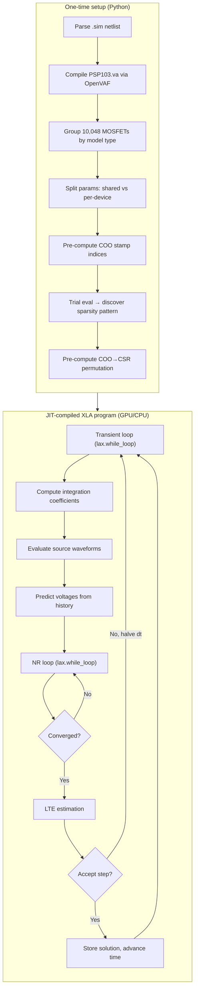
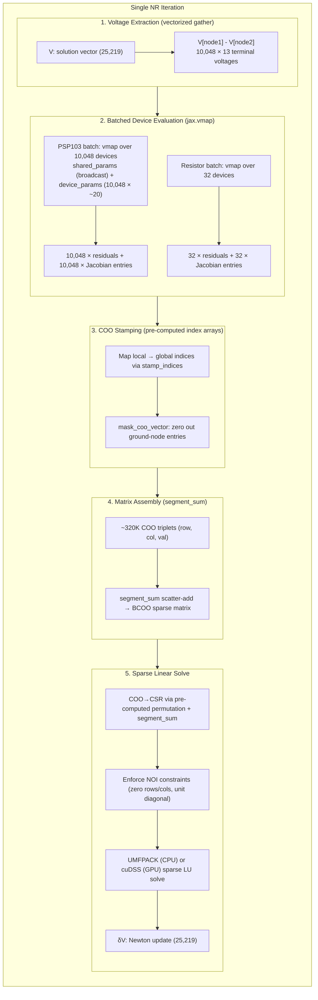
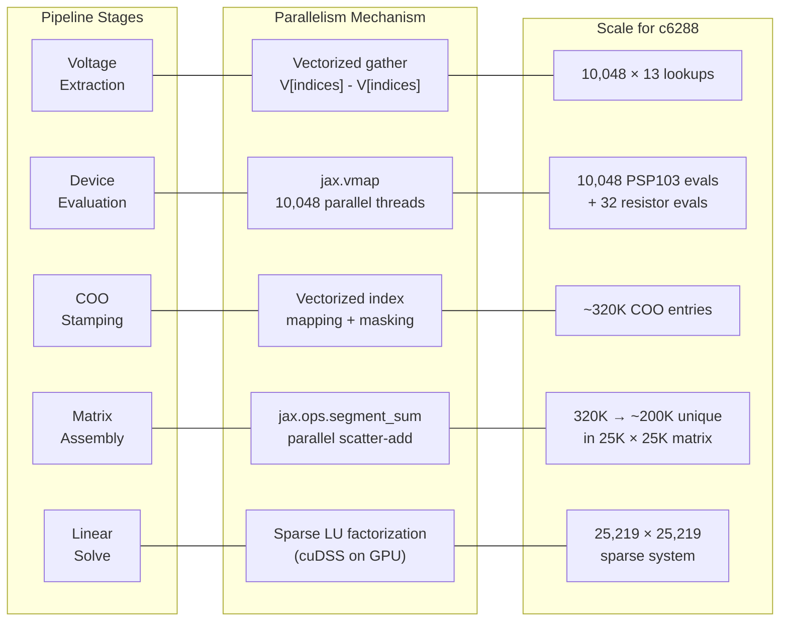
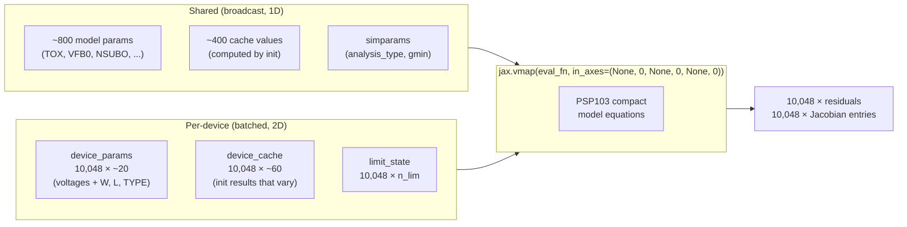
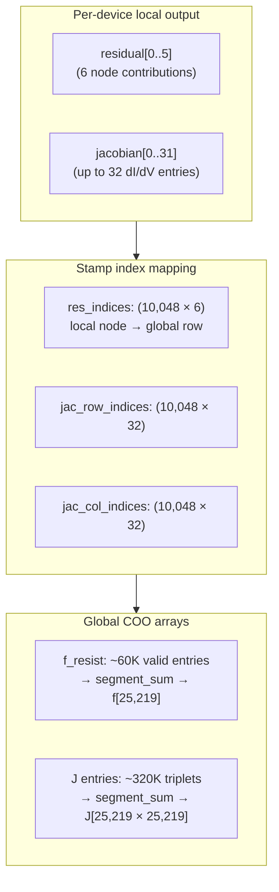
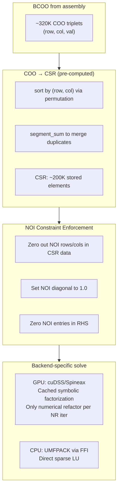
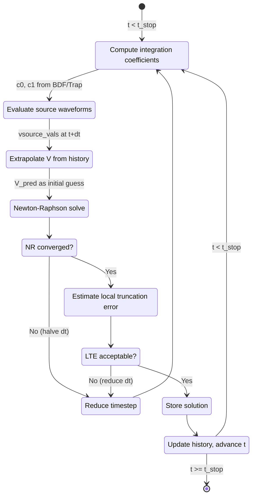

# Parallelism Architecture: c6288 Case Study

This document traces how VAJAX exploits parallelism at every stage of circuit
simulation, using the c6288 16x16 combinational multiplier as a concrete example.

## Circuit Overview

The c6288 circuit is a 16-bit Wallace-tree multiplier:

- **256 AND gates** (6 MOSFETs each: 3 PMOS + 3 NMOS)
- **2,128 NOR gates** (4 MOSFETs each: 2 PMOS + 2 NMOS)
- **10,048 PSP103 MOSFETs** total (single model, TYPE parameter distinguishes NMOS/PMOS)
- **32 resistors** (in input drivers)
- **34 voltage sources** (32 driver + VDD + VSS)
- **~5,089 external circuit nodes**

After node collapse (PSP103 has 8 internal nodes, 6 collapse), the system has:
- 5,089 external nodes + 20,096 internal nodes (2 per MOSFET) + 34 vsource branch currents
- **~25,219 unknowns** in the augmented MNA system

## End-to-End Pipeline

The entire simulation -- all timesteps, all Newton-Raphson iterations, all device
evaluations -- compiles into a **single XLA program** via `jax.jit`. After the
one-time JIT warmup, zero Python interpreter overhead remains.

## Newton-Raphson Iteration Detail

Each NR iteration is the performance-critical inner loop. Here is what happens
inside `build_system_mna` + `linear_solve`:

## Where Parallelism Happens

Each stage has a distinct parallelism mechanism:

## Parameter Splitting: Shared vs Per-Device

The key optimization for batched evaluation is separating parameters that are
constant across all 10,048 MOSFETs from those that vary per device.

The `in_axes=(None, 0, None, 0, None, 0)` specification tells JAX:
- `None`: broadcast this input to all 10,048 invocations (shared params, shared cache, simparams)
- `0`: slice along the first dimension, one row per device (device params, device cache, limit state)

This means the ~800 shared model parameters are loaded once into registers/cache,
while only the ~20 varying parameters differ per thread.

## COO Stamping and Assembly

Each device produces local residuals and Jacobian entries indexed by local
node numbers (0..12 for PSP103). These must be mapped to global circuit indices.

Ground-node entries are mapped to index -1 and masked to zero, so they don't
pollute the system.

## Sparse Solver Path

The c6288 system is too large for dense linear algebra (25K × 25K × 8 bytes = ~5GB).
The sparse path avoids materializing the full matrix:

The COO→CSR conversion is itself parallel: the permutation and segment_sum are
pre-computed during setup, so at runtime it's just a gather + scatter-add.

## Transient Time-Stepping Loop

The outer loop is also JIT-compiled via `lax.while_loop`:

## Performance Profile

For c6288 on CPU (CI benchmark results):

| Metric | Value |
|--------|-------|
| Timesteps | ~1,000 |
| NR iterations/step | 5-20 |
| Device evals/NR iter | 10,048 PSP103 + 32 resistors |
| Per-step time (VAJAX) | 90 ms |
| Per-step time (VACASK) | 80 ms |
| Total wall time (VAJAX) | 65.7s (includes JIT) |
| Total wall time (VACASK) | 80.2s |
| Speedup (total) | **1.22x faster** (JIT amortized) |

The per-step overhead (~10ms) comes from adaptive timestep machinery, `jnp.where`
branching, and COO assembly. This overhead is fixed regardless of circuit size,
which is why c6288 (~90ms/step) is competitive while small circuits (rc: 0.014ms
VAJAX vs 0.002ms VACASK) show higher ratios.

On GPU, the vmap'd device evaluation and cuDSS sparse solve provide additional
speedup for large circuits, as the 10,048 parallel PSP103 evaluations map
directly to GPU threads.
