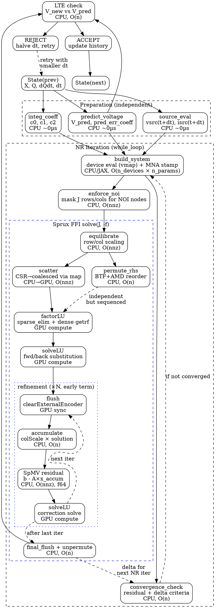
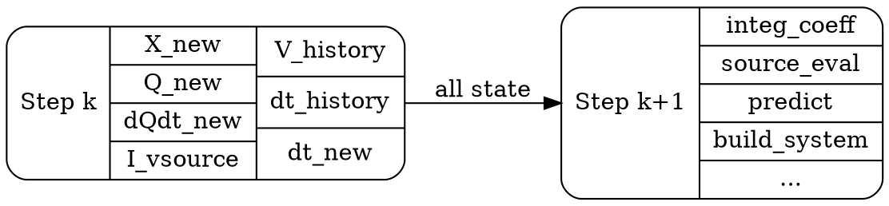

# Transient Step Data Dependencies

This document describes the data flow and dependencies within a single adaptive
transient timestep, including the Newton-Raphson solve loop and the Sprux Metal
sparse solver phases. It identifies parallelism opportunities.

## Overview

Each timestep in the adaptive transient simulation (`body_fn` in `full_mna.py`)
follows this pipeline:

```
State(prev) → [prep] → [NR loop] → [LTE check] → [accept/reject] → State(next)
```

## Dependency Graph (ASCII)

```
TRANSIENT STEP
══════════════

                    ┌─────────────────┐
                    │  State (prev)   │
                    │ X, Q, dQdt, dt  │
                    └────────┬────────┘
                             │
              ┌──────────────┼──────────────┐
              ▼              ▼              ▼
    ┌─────────────┐  ┌──────────────┐  ┌────────────┐
    │  integ_coeff│  │  source_eval │  │  predict   │
    │  c0,c1,c2   │  │  vsrc, isrc  │  │  V_pred    │
    └──────┬──────┘  └──────┬───────┘  └─────┬──────┘
           │                │                │
           └────────────────┼────────────────┘
                            ▼
              ┌─────────────────────────┐
              │     NR SOLVE LOOP       │ ◄── lax.while_loop
              │  (1-N iterations)       │     or lax.fori_loop
              └────────────┬────────────┘
                           │
           ┌───────────────┼───────────────┐
           ▼               ▼               ▼
    ┌─────────────┐  ┌───────────┐  ┌────────────┐
    │build_system │  │enforce_noi│  │ converge?  │
    │ device eval │  │ mask J, f │  │ δ + f check│
    │ + MNA stamp │  │           │  │            │
    └──────┬──────┘  └─────┬─────┘  └────────────┘
           │               │
           ▼               ▼
    ┌──────────────────────────────────────────────┐
    │           Sprux FFI: solve(J, -f)            │
    │                                              │
    │  ┌──────────────┐                            │
    │  │ equilibrate  │  CPU, O(nnz)               │
    │  └──────┬───────┘                            │
    │         ▼                                    │
    │  ┌──────────────┐  ┌──────────────┐          │
    │  │   scatter    │  │ permute_rhs  │          │
    │  │ CSR→coalesced│  │ BTF+AMD perm │          │
    │  │ CPU, O(nnz)  │  │ CPU, O(n)    │          │
    │  └──────┬───────┘  └──────┬───────┘          │
    │         └────────┬────────┘                  │
    │                  ▼                           │
    │  ┌──────────────────────────┐                │
    │  │       factorLU          │  GPU            │
    │  │  sparse_elim (levels)   │                 │
    │  │  + dense getrf (lumps)  │                 │
    │  └──────────┬──────────────┘                │
    │             ▼                                │
    │  ┌──────────────────────────┐                │
    │  │       solveLU           │  GPU            │
    │  │  fwd/back substitution  │                 │
    │  └──────────┬──────────────┘                │
    │             ▼                                │
    │  ┌──────────────────────────┐                │
    │  │   refinement (×N)       │  encoder cycle  │
    │  │  ┌─ flush GPU ────────┐ │                 │
    │  │  │ accumulate  (CPU)  │ │  O(n)           │
    │  │  │ SpMV resid  (CPU)  │ │  O(nnz), f64    │
    │  │  │ solveLU     (GPU)  │ │                 │
    │  │  └────────────────────┘ │                 │
    │  └──────────┬──────────────┘                │
    │             ▼                                │
    │  ┌──────────────────────────┐                │
    │  │  final flush + unperm   │  CPU, O(n)      │
    │  └──────────────────────────┘                │
    └──────────────────┬───────────────────────────┘
                       │
                       ▼ (X_new, Q, dQdt, I_vsource)
                ┌──────────────┐
                │   LTE check  │
                │ V_new vs     │
                │ V_pred       │
                └──────┬───────┘
                       │
                ┌──────┴──────┐
                ▼             ▼
          ┌─────────┐  ┌──────────┐
          │ ACCEPT  │  │  REJECT  │
          │ update  │  │ halve dt │
          │ history │  │ retry    │
          └─────────┘  └──────────┘
```

## Machine-Readable Graph (DOT)



## Phase Timing (c6288, ~5k nodes, Apple M4 Pro)

| Phase | Location | Time (ms) | Complexity |
|-------|----------|-----------|------------|
| integ_coeff | CPU | ~0 | O(1) |
| source_eval | CPU | ~0 | O(n_sources) |
| predict_voltage | CPU | ~0 | O(n) |
| build_system | CPU/JAX | ~15-20 | O(n_devices × params) |
| enforce_noi | CPU | ~0 | O(nnz) |
| **equilibrate** | CPU | **5-10** | O(nnz) |
| **scatter** | CPU→GPU | **2-5** | O(nnz) |
| permute_rhs | CPU | ~1 | O(n) |
| **factorLU** | GPU | **30-40** | supernodal LU |
| solveLU | GPU | 2-5 | fwd/back subst |
| refine (×N) | CPU+GPU | 5-15 | N × (O(nnz) + solve) |
| LTE check | CPU | ~0 | O(n) |
| **Total per step** | | **~80** | |
| UMFPACK comparison | CPU | ~60 | |

## Parallelism Opportunities

### 1. scatter ∥ permute_rhs
These write to different buffers (`dataGpu` vs `xGpu`) and are independent.
Savings: ~1ms (minor).

### 2. Split-phase factorization
`beginFactorLU` submits GPU sparse elimination and returns immediately.
CPU can do refinement SpMV from the previous iteration while GPU factors.
`finishFactorLU` waits for GPU and runs dense loop.
Savings: overlap ~3ms CPU SpMV with GPU sparse elim.

### 3. Speculative next-NR build_system
After factorLU is submitted (GPU busy), CPU could speculatively start
`build_system` for the next NR iteration. If convergence check passes,
discard the speculative work. If it fails, the build_system result is
ready immediately.
Savings: overlap ~15-20ms build_system with GPU factor+solve.
Risk: wasted work on convergence (typical NR = 1-2 iterations).

### 4. Pipelined equilibrate + scatter
For the next NR iteration, equilibration could start as soon as
`build_system` produces the new CSR values, even before the current
solve completes.

### 5. CPU SpMV parallelization
The f64 SpMV in refinement is single-threaded. Using Accelerate's
`sparse_matrix_vector_multiply_double` or OpenMP could give 2-4x speedup.
Savings: ~2ms per refinement iteration.

## Inter-Step Data Dependencies

Each step produces state consumed by the next. The key question for
pipelining is: which outputs from step k are needed to *start* step k+1?

### State Flow Between Steps



### Detailed Inter-Step Dependencies

```
Step k outputs              Step k+1 inputs              When needed
─────────────────           ──────────────────           ────────────
X_new (voltages)     ──→    build_system (X_init)        NR iteration start
                     ──→    predict_voltage (V_history)   step start (via history)
                     ──→    LTE V_max_historic update     step end

Q_new (charges)      ──→    integ companion (Q_prev)     NR iteration (c1 term)
Q_prev → Q_prev2    ──→    GEAR2 companion (c2 term)    NR iteration

dQdt_new             ──→    TRAP companion (d1 term)     NR iteration

dt_new               ──→    integ_coeff (c0=f(dt))       step start
                     ──→    source_eval (t + dt)          step start
                     ──→    predict_voltage               step start
                     ──→    GEAR2 omega (dt/dt_prev)      step start

V_history[0..N]      ──→    predict_voltage               step start
dt_history[0..N]     ──→    predict_voltage               step start
                     ──→    GEAR2 omega                   step start

limit_state          ──→    build_system (limiting)       NR iteration start
V_max_historic       ──→    LTE tolerance                 step end
max_res_contrib      ──→    NR residual floor             NR iteration
accept/reject        ──→    dt selection, history update  step end
```

### Critical Path for Step Startup

Step k+1 CANNOT start until step k completes because:

1. **dt_new** depends on LTE check which needs X_new (full NR solution)
2. **X_new** is the initial guess for step k+1's NR iteration
3. **Q_new** is needed for the integration companion model
4. On **reject**: step k retries with halved dt (same state, no advancement)

This means **steps are strictly sequential** — no pipelining between steps.

### What COULD Be Pipelined (Speculative)

If we split step k+1's startup into phases:

```
Step k:  [...factorLU...][solveLU][refine][LTE][accept]
Step k+1:                                       [integ][source][predict][build_system][...]
                                                 ↑
                                        only needs: dt_new, X_new, Q_new
```

The `integ_coeff` + `source_eval` + `predict_voltage` only need `dt_new`
and history. If we **speculated** that step k would be accepted (common case),
we could start step k+1's preparation while step k's LTE check runs.
But this requires:
- Accepting the risk of wasted work on rejection (~5-10% of steps)
- Buffering two steps' worth of state
- Breaking the `lax.while_loop` abstraction (JAX traces the whole loop)

### Fixed-Step Opportunity

For **fixed-step mode** (no LTE, no rejection):
- `dt` is constant → `integ_coeff` is constant → can precompute
- `source_eval(t + dt)` can be precomputed for all steps (vectorized)
- No rejection → steps always accepted → pipelining is safe
- GPU factor of step k+1 could overlap with CPU refinement of step k

This is why the `fori_loop` path exists — IREE can fuse all iterations.

## Machine-Readable Dependency Table (JSON)

```json
{
  "intra_step_phases": [
    {"id": "integ_coeff", "deps": ["state_prev"], "location": "cpu", "cost": "O(1)"},
    {"id": "source_eval", "deps": ["state_prev"], "location": "cpu", "cost": "O(n_sources)"},
    {"id": "predict", "deps": ["state_prev"], "location": "cpu", "cost": "O(n)"},
    {"id": "build_system", "deps": ["integ_coeff", "source_eval", "predict", "state_prev"], "location": "cpu_jax", "cost": "O(n_devices)"},
    {"id": "enforce_noi", "deps": ["build_system"], "location": "cpu", "cost": "O(nnz)"},
    {"id": "equilibrate", "deps": ["enforce_noi"], "location": "cpu", "cost": "O(nnz)"},
    {"id": "scatter", "deps": ["equilibrate"], "location": "cpu_to_gpu", "cost": "O(nnz)"},
    {"id": "permute_rhs", "deps": ["equilibrate"], "location": "cpu", "cost": "O(n)"},
    {"id": "factor_lu", "deps": ["scatter", "permute_rhs"], "location": "gpu", "cost": "supernodal_lu"},
    {"id": "solve_lu", "deps": ["factor_lu"], "location": "gpu", "cost": "fwd_back_subst"},
    {"id": "refine_flush", "deps": ["solve_lu"], "location": "gpu_sync", "cost": "O(1)"},
    {"id": "refine_spmv", "deps": ["refine_flush"], "location": "cpu", "cost": "O(nnz)"},
    {"id": "refine_solve", "deps": ["refine_spmv"], "location": "gpu", "cost": "fwd_back_subst"},
    {"id": "final_flush", "deps": ["refine_solve"], "location": "gpu_sync", "cost": "O(1)"},
    {"id": "convergence_check", "deps": ["final_flush", "build_system"], "location": "cpu", "cost": "O(n)"},
    {"id": "lte_check", "deps": ["final_flush", "predict"], "location": "cpu", "cost": "O(n)"},
    {"id": "accept_reject", "deps": ["lte_check", "convergence_check"], "location": "cpu", "cost": "O(1)"}
  ],
  "inter_step_deps": [
    {"from": "accept_reject", "to": "integ_coeff", "data": "dt_new"},
    {"from": "accept_reject", "to": "source_eval", "data": "t_new, dt_new"},
    {"from": "accept_reject", "to": "predict", "data": "V_history, dt_history"},
    {"from": "final_flush", "to": "build_system", "data": "X_new (initial guess)"},
    {"from": "final_flush", "to": "build_system", "data": "Q_new, dQdt_new (companion)"},
    {"from": "accept_reject", "to": "build_system", "data": "limit_state"}
  ],
  "parallelism": {
    "independent_pairs": [
      ["integ_coeff", "source_eval", "predict"],
      ["scatter", "permute_rhs"]
    ],
    "split_phase": {
      "factor_lu": ["begin_factor_lu (gpu_async)", "finish_factor_lu (gpu_wait + cpu_dense)"],
      "overlap_with": "refine_spmv from previous iteration"
    },
    "speculative": {
      "step_k1_source_eval": "can start if step_k acceptance is predicted",
      "risk": "wasted work on rejection"
    }
  }
}
```

## Batch-Adaptive Mode

### Motivation

The current adaptive mode is strictly sequential: each step's `dt_new`
depends on the LTE check which needs the full NR solution. This prevents
inter-step pipelining and GPU fusion.

The existing `fori_loop` mode solves this by using fixed dt — but loses
adaptive timestep control, leading to either too many steps (dt too small)
or accuracy problems (dt too large).

**Batch-adaptive** bridges the gap: hold dt constant for a batch of K steps,
then adapt dt between batches. This enables GPU fusion within each batch
while retaining adaptive timestep control at the batch boundary.

### Algorithm

```
while t < t_stop:
    # 1. Predict and choose batch parameters
    V_pred = predict_voltage(history, dt)
    source_vals[0..K-1] = eval_sources(t + dt, t + 2*dt, ..., t + K*dt)

    # 2. Execute batch of K steps with fixed dt (fusible)
    X_batch, Q_batch = scan(nr_step, init=(X, Q), xs=source_vals)
    #                  ^^^^
    #   lax.scan / fori_loop: K steps, same dt, same integ coefficients
    #   GPU can pipeline/fuse all K factorizations

    # 3. LTE check at batch boundary
    V_final = X_batch[-1]
    dt_lte = compute_lte(V_final, V_pred, dt)

    if dt / dt_lte > redo_factor:
        # Reject batch: halve dt, reduce K, retry
        dt = dt / 2
        K = max(K // 2, 1)
    else:
        # Accept batch: advance time, update history
        t += K * dt
        update_history(X_batch, dt)
        dt = dt_lte
        K = min(K * 2, K_max)  # grow batch if stable
```

### Data Flow

```
                    ┌──────────────────┐
                    │  Batch Start     │
                    │  X, Q, dt, K     │
                    └────────┬─────────┘
                             │
              ┌──────────────┼──────────────┐
              ▼              ▼              ▼
    ┌─────────────┐  ┌──────────────┐  ┌────────────┐
    │ integ_coeff │  │ source_eval  │  │  predict   │
    │ (constant   │  │ (all K steps │  │  V_pred    │
    │  for batch) │  │  vectorized) │  │  (once)    │
    └──────┬──────┘  └──────┬───────┘  └─────┬──────┘
           │                │                │
           └────────────────┼────────────────┘
                            ▼
              ┌─────────────────────────┐
              │  lax.scan over K steps  │ ◄── GPU-fusible
              │                         │
              │  step 0: build→NR→solve │
              │  step 1: build→NR→solve │ (uses step 0 output)
              │  step 2: build→NR→solve │ (uses step 1 output)
              │  ...                    │
              │  step K-1: → X_final    │
              └────────────┬────────────┘
                           │
                    ┌──────┴──────┐
                    ▼             ▼
             ┌───────────┐  ┌──────────┐
             │ LTE check │  │ NR check │
             │ V_final   │  │ all steps│
             │ vs V_pred │  │converged?│
             └─────┬─────┘  └────┬─────┘
                   │              │
            ┌──────┴──────────────┘
            ▼
     ┌──────┴──────┐
     ▼             ▼
┌─────────┐  ┌──────────┐
│ ACCEPT  │  │  REJECT  │
│ batch   │  │  batch   │
│ t += K*dt│  │ dt /= 2 │
│ grow K  │  │ shrink K │
└─────────┘  └──────────┘
```

### Why Batching Enables GPU Fusion

Within a batch:
- `dt` is constant → `integ_coeff` (c0, c1, c2) is constant
- Source waveforms are precomputed for all K timesteps
- No LTE check between steps → no CPU↔GPU sync barrier
- `lax.scan` compiles to a loop that XLA/IREE can fuse

For Sprux specifically, batching means:
- **One recording pass** covers all K factorizations (same structure)
- **One command buffer** can encode all K × (factor + solve) dispatches
- GPU stays busy without encoder cycling gaps between steps
- CPU preprocessing (equilibrate, scatter) for step k+1 can overlap
  with GPU factor+solve for step k

### Batch Size Selection

The optimal K depends on how smoothly the solution changes:

| Circuit phase | dt stability | Optimal K |
|---------------|-------------|-----------|
| DC ramp-up | dt grows rapidly | K=1-2 (nearly per-step adaptive) |
| Steady oscillation | dt stable | K=8-16 (long batches) |
| Sharp transient | dt drops suddenly | K=1 (fall back to per-step) |
| Post-transient settling | dt grows | K=4-8 |

An adaptive K strategy:
- Start with K=1 (equivalent to current mode)
- After M consecutive accepted batches at the same dt, double K
- On rejection, halve K (minimum 1)
- Cap K at K_max (e.g., 16 or 32)

### LTE Accuracy with Batching

Standard LTE compares `V_new` with a prediction `V_pred` made from
history points *before* the current step. With batch size K:

- `V_pred` is computed once at batch start using the pre-batch history
- After K steps, `V_final` has drifted K×dt from the prediction point
- The LTE estimate is for the accumulated error over K steps

This is conservative: if K steps with the same dt pass LTE at the batch
boundary, each individual step would also pass. The converse is not true —
a batch might fail LTE even though each step individually would pass
(because error accumulates). This means:

- Batching never accepts steps that per-step mode would reject ✓
- Batching may reject batches that per-step mode would accept (conservative) ✓
- The adaptive K strategy compensates: if batches keep failing, K shrinks to 1

### Implementation Sketch

```python
def batch_adaptive_body(state):
    """Outer loop: manages batch execution and dt adaptation."""
    K = state.batch_size
    dt = state.dt

    # Precompute sources for all K steps
    t_points = state.t + dt * jnp.arange(1, K + 1)
    source_vals = vmap(jit_source_eval)(t_points)  # (K, n_sources)

    # Predict from history (for LTE at batch end)
    V_pred, pred_err_coeff = predict_voltage(state.V_history, ...)

    # Fixed integ coefficients for the batch
    c0, c1, d1, c2 = compute_integ_coeffs(dt, state.dt_history, method)

    # Run K steps with lax.scan (GPU-fusible)
    def scan_step(carry, source_k):
        X, Q, dQdt, Q_prev2, limit_state = carry
        vsrc, isrc = source_k

        X_new, _, converged, _, Q_new, dQdt_new, I_vs, ls_new, _ = nr_solve(
            X, vsrc, isrc, Q, c0, device_arrays,
            gmin, gshunt, c1, d1, dQdt, c2, Q_prev2,
            limit_state, res_tol_floor,
        )
        # For GEAR2: shift Q history
        return (X_new, Q_new, dQdt_new, Q, ls_new), (X_new, converged)

    init_carry = (state.X, state.Q_prev, state.dQdt_prev,
                  state.Q_prev2, state.limit_state)
    final_carry, (X_traj, converged_traj) = lax.scan(
        scan_step, init_carry, (source_vals_v, source_vals_i)
    )

    # Check: did all NR solves converge?
    all_converged = jnp.all(converged_traj)

    # LTE check on final solution
    X_final = final_carry[0]
    V_final = X_final[:n_total]
    dt_lte, lte_norm = compute_lte(V_final, V_pred, ...)

    # Accept/reject batch
    lte_reject = (dt / dt_lte > redo_factor) & all_converged
    nr_reject = ~all_converged

    # ... update state, adjust K and dt ...
```

### Comparison

| Mode | dt control | GPU fusion | Overhead |
|------|-----------|-----------|----------|
| while_loop (current) | per-step | none (CPU↔GPU sync each step) | ~80ms/step |
| fori_loop (fixed) | none | full (IREE fuses all iters) | ~0.2ms/step |
| **batch-adaptive** | per-batch | within batch (scan fusible) | per-step + batch overhead |

### Empirical LTE Analysis (c6288)

Measured on c6288 (5123 nodes, 100 steps, Apple M4 Pro):

| Phase | Steps | dt range | LTE/tol range | NR iters | Batchable? |
|-------|-------|----------|---------------|----------|------------|
| Warmup | 2-6 | 0.5→0.05ps | n/a (no estimate) | 3-5 | No (dt shrinking) |
| Ramp-up | 7-43 | 0.04→4.0ps | 0.05-4.4 | 1-3 | Marginal (dt growing fast) |
| Steady state | 43-61 | 2.5-4.0ps | 0.5-2.5 | 1 | **Yes (38 consecutive accepts)** |
| Transition | 62-70 | 0.17-3.2ps | 0.04-89 | 1-4 | No (rejections, dt crash) |
| Post-transition | 71-120 | 0.8-3.0ps | 0.2-20 | 1 | Partial (dt varies 2x) |

Key findings:
- **4 rejections in 120 steps** (3.3% rejection rate)
- **38 consecutive accepted steps** in steady state (steps 24-61), all NR=1
- dt changes ~20-50% per step even in steady state (not constant)
- LTE/tol rarely exceeds 10 in steady state → conservative acceptance
- **K=4 is safe** for steady state; K=8 possible but riskier
- Near input transitions (t≈100ps), K must drop to 1

### Double-Buffered Pipelined NR

Within each batch step, NR iterations are sequential (each depends on the
previous solution). But with double-buffered GPU data slots, we can **pipeline
CPU prep with GPU factorization**:

```
Slot A: prep₀ → encode₀ ──────────────── flush₀+refine₀
Slot B:          prep₁ → encode₁ ──────────────── flush₁+refine₁
Slot A:                    prep₂ → encode₂ ──────────────── ...

GPU:    [──factor₀+solve₀──][──factor₁+solve₁──][──factor₂+solve₂──]
CPU:    [prep₀][prep₁───────][prep₂──────────────][prep₃─────────────]
                ↑ overlaps    ↑ overlaps           ↑ overlaps
```

Where "prep" = build_system + equilibrate + scatter (CPU, ~20-25ms on c6288).

This requires a slot-based API in SpruxFFISolver:

```cpp
// CPU: equilibrate + scatter + permute RHS into slot k's buffers
int prepare_solve(const double* csr_data, const double* rhs);
//  ^returns slot id (0 or 1, ping-pong)

// GPU: encode factorLU + solveLU for slot k
void encode_factor_solve(int slot);

// CPU: flush GPU, refine from slot k, write result
int flush_and_refine(int slot, const double* csr_data,
                     const double* rhs, double* x_out);
```

Each slot owns: `MetalMirror<float> dataGpu`, `MetalMirror<float> xGpu`,
cached equilibration scales. `devPivots` and `numCtx`/`solveCtx` are shared
(GPU processes slots sequentially within the command buffer).

### Combined Strategy

The full optimization combines batch-adaptive (inter-step) with
double-buffered pipelining (intra-step NR):

```
Batch k (K steps, fixed dt):
  lax.scan:
    step 0: [prep₀(slotA)] [encode₀] ... [flush₀] → X₀
    step 1: [prep₁(slotB)] [encode₁] ... [flush₁] → X₁  (pipelined)
    ...
  LTE check on X_{K-1} vs V_pred

Batch k+1:
  dt_new from LTE
  K_new = adjust(K, accepted?)
  ...
```

### DOT Graph

```dot
digraph batch_adaptive {
  rankdir=TB;
  node [shape=box, style=rounded];

  batch_start [label="Batch Start\nX, Q, dt, K"];

  subgraph cluster_prep {
    label="Batch Preparation (once)";
    style=dashed;
    integ [label="integ_coeff\n(constant for batch)"];
    sources [label="source_eval\n(vectorized, K steps)"];
    pred [label="predict_voltage\n(once, for LTE)"];
  }

  subgraph cluster_scan {
    label="lax.scan (K steps, GPU-fusible)";
    color=blue;
    step0 [label="step 0\nbuild→NR→solve"];
    step1 [label="step 1\nbuild→NR→solve"];
    step2 [label="step 2\nbuild→NR→solve"];
    stepK [label="step K-1\n→ X_final"];

    step0 -> step1 [label="X₀,Q₀"];
    step1 -> step2 [label="X₁,Q₁"];
    step2 -> stepK [style=dashed, label="..."];
  }

  lte [label="LTE check\nV_final vs V_pred"];
  nr_check [label="NR check\nall converged?"];
  accept [label="ACCEPT\nt += K*dt\ngrow K"];
  reject [label="REJECT\ndt /= 2\nshrink K"];

  batch_start -> {integ sources pred};
  {integ sources} -> step0;
  stepK -> {lte nr_check};
  pred -> lte;
  {lte nr_check} -> accept;
  {lte nr_check} -> reject;
  reject -> batch_start [style=dashed, label="retry"];
  accept -> batch_start [style=dashed, label="next batch"];
}
