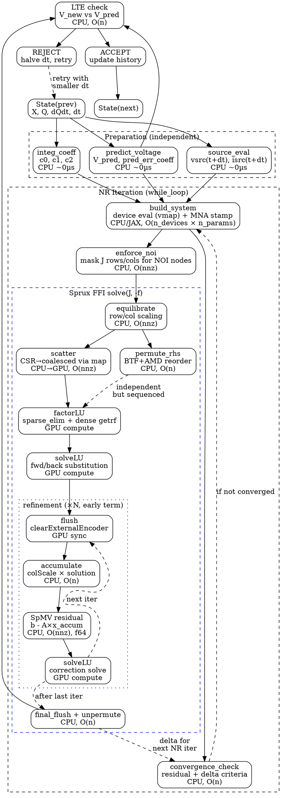
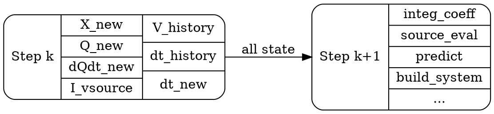

# Transient Step Data Dependencies

This document describes the data flow and dependencies within a single adaptive
transient timestep, including the Newton-Raphson solve loop and the Sprux Metal
sparse solver phases. It identifies parallelism opportunities.

## Overview

Each timestep in the adaptive transient simulation (`body_fn` in `full_mna.py`)
follows this pipeline:

```
State(prev) → [prep] → [NR loop] → [LTE check] → [accept/reject] → State(next)
```

## Dependency Graph (ASCII)

```
TRANSIENT STEP
══════════════

                    ┌─────────────────┐
                    │  State (prev)   │
                    │ X, Q, dQdt, dt  │
                    └────────┬────────┘
                             │
              ┌──────────────┼──────────────┐
              ▼              ▼              ▼
    ┌─────────────┐  ┌──────────────┐  ┌────────────┐
    │  integ_coeff│  │  source_eval │  │  predict   │
    │  c0,c1,c2   │  │  vsrc, isrc  │  │  V_pred    │
    └──────┬──────┘  └──────┬───────┘  └─────┬──────┘
           │                │                │
           └────────────────┼────────────────┘
                            ▼
              ┌─────────────────────────┐
              │     NR SOLVE LOOP       │ ◄── lax.while_loop
              │  (1-N iterations)       │     or lax.fori_loop
              └────────────┬────────────┘
                           │
           ┌───────────────┼───────────────┐
           ▼               ▼               ▼
    ┌─────────────┐  ┌───────────┐  ┌────────────┐
    │build_system │  │enforce_noi│  │ converge?  │
    │ device eval │  │ mask J, f │  │ δ + f check│
    │ + MNA stamp │  │           │  │            │
    └──────┬──────┘  └─────┬─────┘  └────────────┘
           │               │
           ▼               ▼
    ┌──────────────────────────────────────────────┐
    │           Sprux FFI: solve(J, -f)            │
    │                                              │
    │  ┌──────────────┐                            │
    │  │ equilibrate  │  CPU, O(nnz)               │
    │  └──────┬───────┘                            │
    │         ▼                                    │
    │  ┌──────────────┐  ┌──────────────┐          │
    │  │   scatter    │  │ permute_rhs  │          │
    │  │ CSR→coalesced│  │ BTF+AMD perm │          │
    │  │ CPU, O(nnz)  │  │ CPU, O(n)    │          │
    │  └──────┬───────┘  └──────┬───────┘          │
    │         └────────┬────────┘                  │
    │                  ▼                           │
    │  ┌──────────────────────────┐                │
    │  │       factorLU          │  GPU            │
    │  │  sparse_elim (levels)   │                 │
    │  │  + dense getrf (lumps)  │                 │
    │  └──────────┬──────────────┘                │
    │             ▼                                │
    │  ┌──────────────────────────┐                │
    │  │       solveLU           │  GPU            │
    │  │  fwd/back substitution  │                 │
    │  └──────────┬──────────────┘                │
    │             ▼                                │
    │  ┌──────────────────────────┐                │
    │  │   refinement (×N)       │  encoder cycle  │
    │  │  ┌─ flush GPU ────────┐ │                 │
    │  │  │ accumulate  (CPU)  │ │  O(n)           │
    │  │  │ SpMV resid  (CPU)  │ │  O(nnz), f64    │
    │  │  │ solveLU     (GPU)  │ │                 │
    │  │  └────────────────────┘ │                 │
    │  └──────────┬──────────────┘                │
    │             ▼                                │
    │  ┌──────────────────────────┐                │
    │  │  final flush + unperm   │  CPU, O(n)      │
    │  └──────────────────────────┘                │
    └──────────────────┬───────────────────────────┘
                       │
                       ▼ (X_new, Q, dQdt, I_vsource)
                ┌──────────────┐
                │   LTE check  │
                │ V_new vs     │
                │ V_pred       │
                └──────┬───────┘
                       │
                ┌──────┴──────┐
                ▼             ▼
          ┌─────────┐  ┌──────────┐
          │ ACCEPT  │  │  REJECT  │
          │ update  │  │ halve dt │
          │ history │  │ retry    │
          └─────────┘  └──────────┘
```

## Machine-Readable Graph (DOT)



## Phase Timing (c6288, ~5k nodes, Apple M4 Pro)

| Phase | Location | Time (ms) | Complexity |
|-------|----------|-----------|------------|
| integ_coeff | CPU | ~0 | O(1) |
| source_eval | CPU | ~0 | O(n_sources) |
| predict_voltage | CPU | ~0 | O(n) |
| build_system | CPU/JAX | ~15-20 | O(n_devices × params) |
| enforce_noi | CPU | ~0 | O(nnz) |
| **equilibrate** | CPU | **5-10** | O(nnz) |
| **scatter** | CPU→GPU | **2-5** | O(nnz) |
| permute_rhs | CPU | ~1 | O(n) |
| **factorLU** | GPU | **30-40** | supernodal LU |
| solveLU | GPU | 2-5 | fwd/back subst |
| refine (×N) | CPU+GPU | 5-15 | N × (O(nnz) + solve) |
| LTE check | CPU | ~0 | O(n) |
| **Total per step** | | **~80** | |
| UMFPACK comparison | CPU | ~60 | |

## Parallelism Opportunities

### 1. scatter ∥ permute_rhs
These write to different buffers (`dataGpu` vs `xGpu`) and are independent.
Savings: ~1ms (minor).

### 2. Split-phase factorization
`beginFactorLU` submits GPU sparse elimination and returns immediately.
CPU can do refinement SpMV from the previous iteration while GPU factors.
`finishFactorLU` waits for GPU and runs dense loop.
Savings: overlap ~3ms CPU SpMV with GPU sparse elim.

### 3. Speculative next-NR build_system
After factorLU is submitted (GPU busy), CPU could speculatively start
`build_system` for the next NR iteration. If convergence check passes,
discard the speculative work. If it fails, the build_system result is
ready immediately.
Savings: overlap ~15-20ms build_system with GPU factor+solve.
Risk: wasted work on convergence (typical NR = 1-2 iterations).

### 4. Pipelined equilibrate + scatter
For the next NR iteration, equilibration could start as soon as
`build_system` produces the new CSR values, even before the current
solve completes.

### 5. CPU SpMV parallelization
The f64 SpMV in refinement is single-threaded. Using Accelerate's
`sparse_matrix_vector_multiply_double` or OpenMP could give 2-4x speedup.
Savings: ~2ms per refinement iteration.

## Inter-Step Data Dependencies

Each step produces state consumed by the next. The key question for
pipelining is: which outputs from step k are needed to *start* step k+1?

### State Flow Between Steps



### Detailed Inter-Step Dependencies

```
Step k outputs              Step k+1 inputs              When needed
─────────────────           ──────────────────           ────────────
X_new (voltages)     ──→    build_system (X_init)        NR iteration start
                     ──→    predict_voltage (V_history)   step start (via history)
                     ──→    LTE V_max_historic update     step end

Q_new (charges)      ──→    integ companion (Q_prev)     NR iteration (c1 term)
Q_prev → Q_prev2    ──→    GEAR2 companion (c2 term)    NR iteration

dQdt_new             ──→    TRAP companion (d1 term)     NR iteration

dt_new               ──→    integ_coeff (c0=f(dt))       step start
                     ──→    source_eval (t + dt)          step start
                     ──→    predict_voltage               step start
                     ──→    GEAR2 omega (dt/dt_prev)      step start

V_history[0..N]      ──→    predict_voltage               step start
dt_history[0..N]     ──→    predict_voltage               step start
                     ──→    GEAR2 omega                   step start

limit_state          ──→    build_system (limiting)       NR iteration start
V_max_historic       ──→    LTE tolerance                 step end
max_res_contrib      ──→    NR residual floor             NR iteration
accept/reject        ──→    dt selection, history update  step end
```

### Critical Path for Step Startup

Step k+1 CANNOT start until step k completes because:

1. **dt_new** depends on LTE check which needs X_new (full NR solution)
2. **X_new** is the initial guess for step k+1's NR iteration
3. **Q_new** is needed for the integration companion model
4. On **reject**: step k retries with halved dt (same state, no advancement)

This means **steps are strictly sequential** — no pipelining between steps.

### What COULD Be Pipelined (Speculative)

If we split step k+1's startup into phases:

```
Step k:  [...factorLU...][solveLU][refine][LTE][accept]
Step k+1:                                       [integ][source][predict][build_system][...]
                                                 ↑
                                        only needs: dt_new, X_new, Q_new
```

The `integ_coeff` + `source_eval` + `predict_voltage` only need `dt_new`
and history. If we **speculated** that step k would be accepted (common case),
we could start step k+1's preparation while step k's LTE check runs.
But this requires:
- Accepting the risk of wasted work on rejection (~5-10% of steps)
- Buffering two steps' worth of state
- Breaking the `lax.while_loop` abstraction (JAX traces the whole loop)

### Fixed-Step Opportunity

For **fixed-step mode** (no LTE, no rejection):
- `dt` is constant → `integ_coeff` is constant → can precompute
- `source_eval(t + dt)` can be precomputed for all steps (vectorized)
- No rejection → steps always accepted → pipelining is safe
- GPU factor of step k+1 could overlap with CPU refinement of step k

This is why the `fori_loop` path exists — IREE can fuse all iterations.

## Machine-Readable Dependency Table (JSON)

```json
{
  "intra_step_phases": [
    {"id": "integ_coeff", "deps": ["state_prev"], "location": "cpu", "cost": "O(1)"},
    {"id": "source_eval", "deps": ["state_prev"], "location": "cpu", "cost": "O(n_sources)"},
    {"id": "predict", "deps": ["state_prev"], "location": "cpu", "cost": "O(n)"},
    {"id": "build_system", "deps": ["integ_coeff", "source_eval", "predict", "state_prev"], "location": "cpu_jax", "cost": "O(n_devices)"},
    {"id": "enforce_noi", "deps": ["build_system"], "location": "cpu", "cost": "O(nnz)"},
    {"id": "equilibrate", "deps": ["enforce_noi"], "location": "cpu", "cost": "O(nnz)"},
    {"id": "scatter", "deps": ["equilibrate"], "location": "cpu_to_gpu", "cost": "O(nnz)"},
    {"id": "permute_rhs", "deps": ["equilibrate"], "location": "cpu", "cost": "O(n)"},
    {"id": "factor_lu", "deps": ["scatter", "permute_rhs"], "location": "gpu", "cost": "supernodal_lu"},
    {"id": "solve_lu", "deps": ["factor_lu"], "location": "gpu", "cost": "fwd_back_subst"},
    {"id": "refine_flush", "deps": ["solve_lu"], "location": "gpu_sync", "cost": "O(1)"},
    {"id": "refine_spmv", "deps": ["refine_flush"], "location": "cpu", "cost": "O(nnz)"},
    {"id": "refine_solve", "deps": ["refine_spmv"], "location": "gpu", "cost": "fwd_back_subst"},
    {"id": "final_flush", "deps": ["refine_solve"], "location": "gpu_sync", "cost": "O(1)"},
    {"id": "convergence_check", "deps": ["final_flush", "build_system"], "location": "cpu", "cost": "O(n)"},
    {"id": "lte_check", "deps": ["final_flush", "predict"], "location": "cpu", "cost": "O(n)"},
    {"id": "accept_reject", "deps": ["lte_check", "convergence_check"], "location": "cpu", "cost": "O(1)"}
  ],
  "inter_step_deps": [
    {"from": "accept_reject", "to": "integ_coeff", "data": "dt_new"},
    {"from": "accept_reject", "to": "source_eval", "data": "t_new, dt_new"},
    {"from": "accept_reject", "to": "predict", "data": "V_history, dt_history"},
    {"from": "final_flush", "to": "build_system", "data": "X_new (initial guess)"},
    {"from": "final_flush", "to": "build_system", "data": "Q_new, dQdt_new (companion)"},
    {"from": "accept_reject", "to": "build_system", "data": "limit_state"}
  ],
  "parallelism": {
    "independent_pairs": [
      ["integ_coeff", "source_eval", "predict"],
      ["scatter", "permute_rhs"]
    ],
    "split_phase": {
      "factor_lu": ["begin_factor_lu (gpu_async)", "finish_factor_lu (gpu_wait + cpu_dense)"],
      "overlap_with": "refine_spmv from previous iteration"
    },
    "speculative": {
      "step_k1_source_eval": "can start if step_k acceptance is predicted",
      "risk": "wasted work on rejection"
    }
  }
}
```
